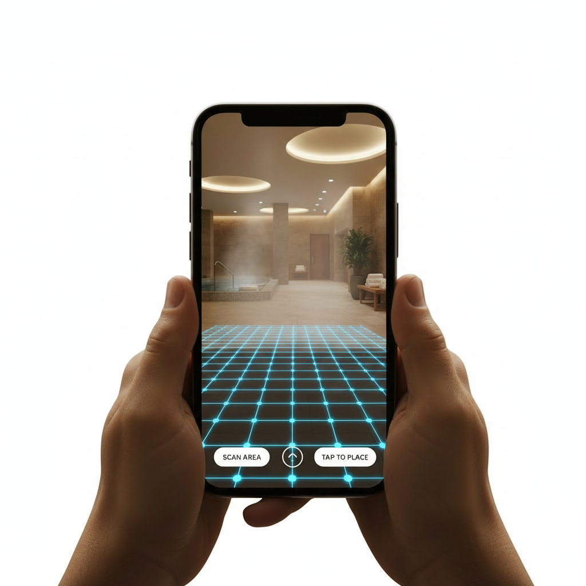
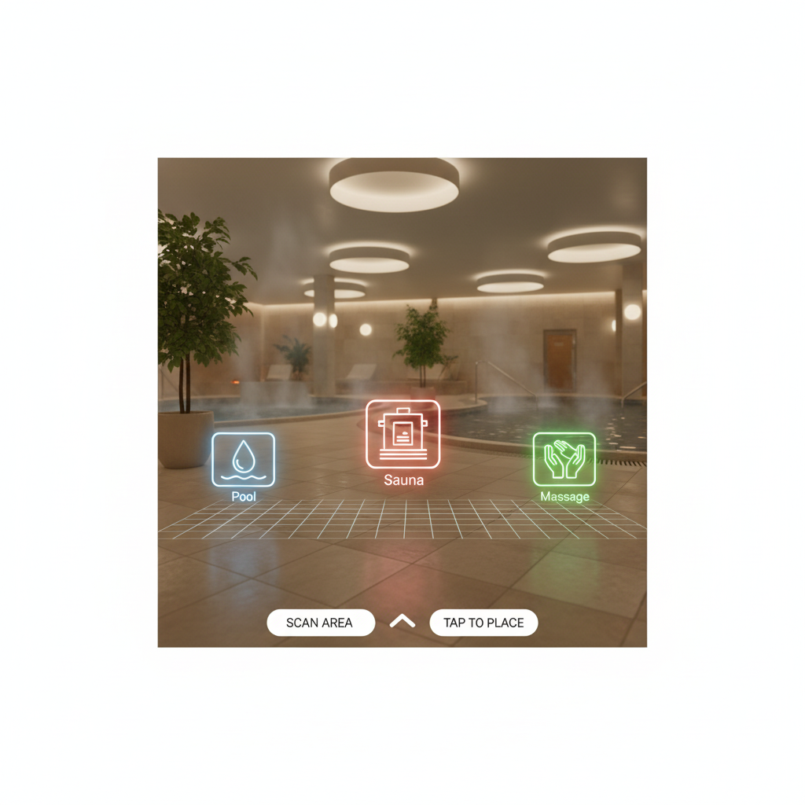
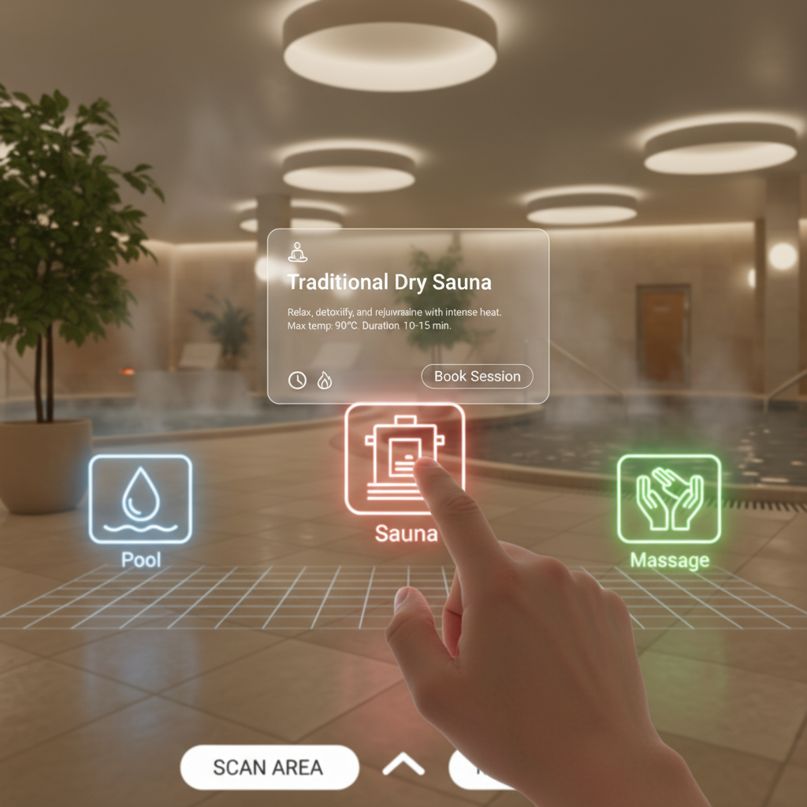

# Vizualizacija scen AR aplikacije

## Scena 1: Zagon aplikacije (AR kamera)

**Opis:**
Uporabnik odpre aplikacijo na mobilnem telefonu. Na zaslonu vidi kamero, ki prikazuje realno okolje (npr. tla ali prostor v termah).

Na zaslonu se izpiše navodilo, da naj uporabnik premika telefon za zaznavanje površine.

Uporabnik lahko:
- premika telefon
- začne zaznavanje AR površine

Namen scene je priprava uporabnika na AR izkušnjo.

---

## Scena 2: AR informacijske točke

**Opis:**
Ko aplikacija zazna površino, se v prostoru prikažejo AR ikone (npr. bazen, savna, wellness).

Ikone so postavljene na tla ali v prostor in označujejo različne storitve.

Uporabnik lahko:
- vidi AR objekte v prostoru
- se premika okoli njih
- klikne na posamezno ikono

Namen scene je predstavitev glavne funkcionalnosti aplikacije.

---

## Scena 3: Prikaz informacij

**Opis:**
Ko uporabnik klikne na AR ikono, se prikaže informacijski panel.

Panel vsebuje:
- ime storitve (npr. Wellness center)
- opis
- delovni čas

Uporabnik lahko:
- bere informacije
- zapre panel

Namen scene je prikaz dodatnih informacij o izbranem objektu.